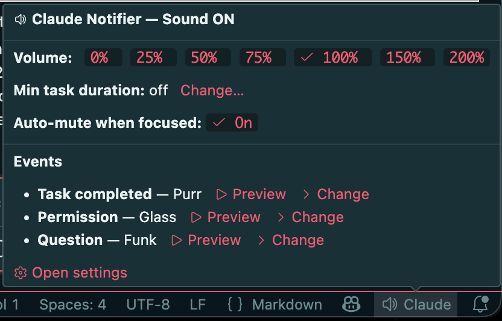

# Claude Notifier

[](https://marketplace.visualstudio.com/items?itemName=SingularityInc.claude-notifier)

Plays a sound and shows a notification when [Claude Code](https://claude.com/claude-code) finishes a task, needs permission, or asks a question.

Stop watching the screen — go grab a coffee and let Claude ping you when it needs you.

Works with **VSCode**, **terminal CLI**, **vim**, or any editor where you use Claude Code — on **macOS**, **Windows**, **WSL**, and **Linux**.

## What's new — 3.3.0



- **Status-bar control panel.** Hover the **Claude** entry in the status bar to open a panel with volume buttons, per-event sound preview and preset swap, and minimum-task-duration threshold control.
- **Minimum task duration threshold.** Set `claudeNotifier.minTaskDurationThreshold` (seconds) to suppress notifications for tasks shorter than the threshold — counted from the moment you submit the prompt. Quiet for the quick stuff, alert for the long stuff.
- **Sound preview on highlight.** Arrow through sound presets in the picker and audition each one at your configured volume before committing.
- **Parallel-session safe.** Multiple Claude sessions across terminals or VSCode windows each track their own threshold independently.
- **Subagent silence by default.** Permission and question prompts that originate from a `Task` subagent are suppressed (no sound, no popup) — toggle with `claudeNotifier.suppressSubagentInteractions`. Subagent completions get their own `SubagentStop` hook (`claudeNotifier.subagentCompleted.level`, default off).

## Install

### Option 1: VSCode Extension

Install from the [VS Marketplace](https://marketplace.visualstudio.com/items?itemName=SingularityInc.claude-notifier):

```sh
code --install-extension SingularityInc.claude-notifier
```

Or search for **"Claude Notifier"** in the Extensions tab (`Cmd+Shift+X` / `Ctrl+Shift+X`).

The extension auto-configures everything on activation. Reload VSCode after installing.

### Option 2: Homebrew (macOS / Linux)

```sh
brew tap ashmitb95/claude-notifier
brew install claude-notifier
```

If `brew install` fails (e.g. outdated Command Line Tools), use the curl method below.

To uninstall:

```sh
brew uninstall claude-notifier
claude-notifier-uninstall  # remove hooks from ~/.claude/settings.json
```

### Option 3: CLI (curl)

**macOS / Linux / WSL:**

```sh
curl -fsSL https://raw.githubusercontent.com/ashmitb95/claude-notifier/main/install.sh | bash
```

To uninstall:

```sh
curl -fsSL https://raw.githubusercontent.com/ashmitb95/claude-notifier/main/uninstall.sh | bash
```

**Windows:** install the VSCode extension. It auto-configures the PowerShell hooks; no separate CLI installer is needed.

## Settings

Open **Settings** → search **"Claude Notifier"** (`Cmd+,` / `Ctrl+,`), or add to your `settings.json`:

```jsonc
{
  // Per-event notification level: "sound+popup" | "sound" | "popup" | "off"
  "claudeNotifier.taskCompleted.level": "sound+popup",
  "claudeNotifier.needsPermission.level": "sound+popup",
  "claudeNotifier.asksQuestion.level": "sound+popup",

  // Per-event sound preset (see list below)
  "claudeNotifier.taskCompleted.sound": "Hero",
  "claudeNotifier.needsPermission.sound": "Glass",
  "claudeNotifier.asksQuestion.sound": "Funk"
}
```

**Notification levels:**

| Level         | Sound | OS notification | VSCode toast |
| ------------- | ----- | --------------- | ------------ |
| `sound+popup` | Yes   | Yes             | Yes          |
| `sound`       | Yes   | No              | No           |
| `popup`       | No    | Yes             | Yes          |
| `off`         | No    | No              | No           |

**Sound presets:**
- macOS: Basso, Blow, Bottle, Frog, Funk, Glass, Hero, Morse, Ping, Pop, Purr, Sosumi, Submarine, Tink
- Windows: Windows Notify, tada, chimes, chord, ding, notify, ringin, Windows Background
- Linux: same names as macOS — each is mapped to a freedesktop XDG sound under `/usr/share/sounds/freedesktop/stereo/`

The global **mute toggle** is triggered by clicking the **Claude** entry in the status bar (the hover panel is for other actions); it's also exposed as `Claude Notifier: Toggle Sound` in the command palette. Mute overrides all per-event settings.

### Status-bar control panel

Hover the **Claude** entry in the status bar to open the control panel (see screenshot at the top). It's anchored above the icon and sticky — move into it to click. Available actions:

- Set volume to 0 / 25 / 50 / 75 / 100 / 150 / 200%.
- Set the minimum task duration threshold (see below).
- Preview each event's current sound at the configured volume.
- Change each event's sound preset with arrow-key audition (preview-on-highlight).
- Open the full settings page.

**Click** the status-bar item to toggle mute (hover opens the panel for every other action).

The picker and preview are also exposed as command-palette entries:

- `Claude Notifier: Choose Sound…`
- `Claude Notifier: Preview Sound…`

### Minimum task duration threshold

`claudeNotifier.minTaskDurationThreshold` (seconds, default `0`)

When `> 0`, notification sounds and popups are suppressed for any task that completes in less than this many seconds. Counted from the moment you submit the prompt. Set to `0` to disable (the default).

Useful when you're actively watching the IDE and don't need audio for sub-second roundtrips — set it to e.g. `10` and you'll only hear audio for longer-running work. Per-session marker files keep parallel Claude sessions (multiple terminals or VS Code windows) independent — each session times its own threshold.

### Subagent handling

Claude Code emits an `agent_id` field on every hook payload that fires from inside a `Task` subagent. Two settings use this:

`claudeNotifier.suppressSubagentInteractions` *(boolean, default `true`)*

When true, permission and question hooks that originate from a subagent are silenced — no sound, no OS banner. The main agent's own permission and question prompts still notify normally. This affects **only the notifier's sound and popup**; the actual approve/deny dialog and question UI in Claude Code's chat are untouched.

`claudeNotifier.subagentCompleted.level` *(default `off`)*

A dedicated `SubagentStop` hook fires when a `Task` subagent finishes. The level defaults to `off`, so subagent completions are silent unless you opt in. Configurable like the other events:

- `claudeNotifier.subagentCompleted.level`: `sound+popup` | `sound` | `popup` | `off`
- `claudeNotifier.subagentCompleted.sound`: a sound preset (default `Pop`)

## How it works

Five [Claude Code hooks](https://docs.anthropic.com/en/docs/claude-code/hooks) are registered:

| Hook                           | Trigger                                                                |
| ------------------------------ | ---------------------------------------------------------------------- |
| `Stop`                         | Claude finishes responding                                             |
| `PermissionRequest`            | Claude needs tool approval                                             |
| `PreToolUse` (AskUserQuestion) | Claude asks a question                                                 |
| `UserPromptSubmit`             | You submit a prompt (coordination-only — no sound, no popup)           |
| `SubagentStop`                 | A `Task` subagent finishes (off by default; opt in to get notified)    |

Each hook reads `~/.claude/hooks/claude-notifier-config.json` (synced from VSCode settings) to determine which sound to play and whether to show notifications.

On **macOS**, hooks use `afplay` and `osascript`. On **Windows** and **WSL**, hooks use PowerShell with `NotifyIcon` balloon tips and system sounds. On **Linux**, hooks use `pw-play` (PipeWire) or `paplay` (PulseAudio) for audio, falling back to `aplay`, and `notify-send` for notifications — install `libnotify` (`notify-send`), a PipeWire (`pipewire-bin` / `pipewire-audio`) or PulseAudio (`pulseaudio-utils`) stack, and the `sound-theme-freedesktop` package if they aren't already present. The sounds are Ogg (`.oga`) files; `aplay` cannot decode them (it plays static), so a PipeWire or PulseAudio player is recommended.

### Behavior

- **Per-session dedup.** Rapid back-to-back events within a single Claude session coalesce automatically — one notification per stage, not a flood. A stage advances when you send your next prompt or after ~30 minutes of idle time.
- **Bundled fallback sounds.** If the configured system sound file is missing on disk, a bundled WAV plays so you still hear something.
- **Defers to other notification hosts.** Inside VS Code, the extension takes over from the hook fallback for the owning window. Inside [cmux](https://github.com/manaflow-ai/cmux), the hook detects cmux's `CMUX_CLAUDE_HOOK_CMUX_BIN` env var and skips its own sound + popup so cmux's native banner doesn't get double-stacked.
- **Diagnostic log.** `View → Output → Claude Notifier` shows activation, signal receipts, dedup decisions, and configuration warnings — useful when debugging "I didn't get a notification."

### Clickable macOS notifications (optional)

By default, macOS attributes `osascript` notifications to the Script Editor bundle, so clicking one opens Script Editor instead of focusing VS Code. To get clickable notifications that focus the specific window the notification fired from, install [`terminal-notifier`](https://github.com/julienXX/terminal-notifier):

```sh
brew install terminal-notifier
```

Or use the bundled command — open the Command Palette and run **"Claude Notifier: Install terminal-notifier (clickable macOS notifications)"**. It runs the `brew install` in an interactive VS Code terminal so you can see what's happening. Reload the window after install to enable it.

When `terminal-notifier` is present, the extension uses it automatically. When it's not, the extension falls back to the standard `osascript` notification (everything still works — clicks just open Script Editor).

## Mute/unmute (CLI)

**macOS / Linux / WSL:**

```sh
touch ~/.claude/hooks/claude-notifier-muted   # mute
rm ~/.claude/hooks/claude-notifier-muted      # unmute
```

**Windows PowerShell:**

```powershell
New-Item "$env:USERPROFILE\.claude\hooks\claude-notifier-muted"   # mute
Remove-Item "$env:USERPROFILE\.claude\hooks\claude-notifier-muted" # unmute
```

## Platform support

| Platform | VSCode Extension | CLI Install | Hook runner                                               |
| -------- | ---------------- | ----------- | --------------------------------------------------------- |
| macOS    | Yes              | Yes         | Node.js                                                   |
| Windows  | Yes              | VSCode only | PowerShell                                                |
| WSL      | Yes              | Yes         | Node.js (calls `powershell.exe` for sounds/notifications) |
| Linux    | Yes              | Yes         | Node.js (uses `pw-play`/`paplay`/`aplay` and `notify-send`) |

## Contributing

See [CONTRIBUTING.md](CONTRIBUTING.md) for dev setup, the test/lint/typecheck gates, code map, and PR conventions. Bug reports and feature requests are welcome — [open an issue](https://github.com/ashmitb95/claude-notifier/issues/new) first to discuss.

### Contributors

Thanks to everyone who has contributed to this project:

[](https://github.com/ashmitb95/claude-notifier/graphs/contributors)

## License

[GPL-3.0](LICENSE.md)
